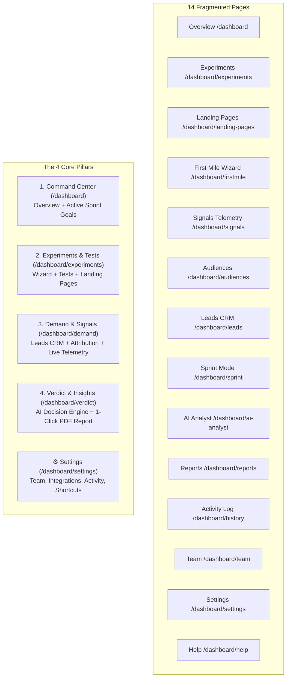

# PoD Engine — Streamlining & Consolidation Roadmap

**Objective:** Transform the PoD Engine dashboard from 14 fragmented pages into a razor-sharp, **4-Pillar Validation Machine** that minimizes cognitive overhead and delivers answers on market demand in under 5 minutes.

---

## 🗺️ Architecture Overview: Before vs. After

---

## 📋 Master Task Checklist

### Phase 1: Pillar 1 — Unified Command Center (`/dashboard`)
*Merge Overview and Sprint Mode into a single executive cockpit.*

- [x] **Task 1.1: Sprint Status Header Component** ✅
  - **File:** `components/dashboard/sprint-banner.tsx` (new)
  - **Description:** Build an inline collapsible banner at the top of `/dashboard` displaying the active validation sprint, remaining days countdown, and quota progress (e.g. `18/25 leads captured • 4 days left`).
  - **Acceptance Criteria:** Shows real-time sprint quota progress; includes "Edit Sprint" modal trigger; collapses cleanly if no sprint is active.

- [x] **Task 1.2: Integrate Sprint Goals into Overview Page** ✅
  - **File:** `app/dashboard/page.tsx`
  - **Description:** Embed `<SprintBanner />` above the 3 core metric cards (Demand Score, Visitors, Conversion Rate).
  - **Acceptance Criteria:** Eliminates the need to navigate to a separate sprint page to check goal status.

- [x] **Task 1.3: Graceful Redirect for Legacy Sprint Route** ✅
  - **File:** `app/dashboard/sprint/page.tsx`
  - **Description:** Redirect `/dashboard/sprint` to `/dashboard?view=sprint` or render the focused sprint configuration view seamlessly.
  - **Acceptance Criteria:** Existing links to `/dashboard/sprint` do not 404.

---

### Phase 2: Pillar 2 — Unified Experiments & Page Builder (`/dashboard/experiments`)
*Merge First Mile Wizard, Landing Pages Manager, and Experiments into one cohesive testing suite.*

- [x] **Task 2.1: Embed First Mile Wizard as Default "New Experiment" Experience** ✅
  - **File:** `app/dashboard/experiments/new/page.tsx`, `components/experiments/experiment-wizard.tsx`
  - **Description:** Refactor the guided 4-step wizard from `/dashboard/firstmile` into `/dashboard/experiments/new`. Guide users from hypothesis → audience selection → landing page generation → live launch in one continuous flow.
  - **Acceptance Criteria:** Clicking "New Experiment" offers both "Quick Setup" and "Guided AI Smoke Test" without leaving `/dashboard/experiments`.

- [x] **Task 2.2: Co-locate Landing Page Variants inside Experiment Detail** ✅
  - **File:** `app/dashboard/experiments/[id]/page.tsx`
  - **Description:** Add a "Landing Pages & Variants" tab directly inside each experiment detail view. Show variant headline, copy, and live `/p/[slug]` iframe preview right next to its conversion stats.
  - **Acceptance Criteria:** Founders no longer need to jump back and forth between `/dashboard/landing-pages` and `/dashboard/experiments`.

- [x] **Task 2.3: Add "All Pages" View within Experiments** ✅
  - **File:** `app/dashboard/experiments/page.tsx`
  - **Description:** Add a top toggle: `[ Experiments (List) ] | [ Live Smoke Pages ]`.
  - **Acceptance Criteria:** Founders can view all live public URLs from one unified hub. Redirect `/dashboard/landing-pages` to `/dashboard/experiments?view=pages`.

---

### Phase 3: Pillar 3 — Unified Demand & Signals (`/dashboard/demand` or `/dashboard/leads`)
*Consolidate Leads CRM, Channel Attribution, and Live Event Telemetry into a 3-tab Demand center.*

- [x] **Task 3.1: Create 3-Tab Demand Hub Layout** ✅
  - **File:** `app/dashboard/leads/page.tsx`
  - **Description:** Create a unified interface with 3 tabs:
    - **Tab 1: Leads CRM**: The existing high-intent waitlist table with search, status filters, and source badges.
    - **Tab 2: Channel Attribution**: Visual traffic source breakdown (Meta, Google, LinkedIn, Organic, Direct) and conversion rate per channel.
    - **Tab 3: Live Signal Stream**: Real-time telemetry feed of visitor clicks, scrolls, and pricing interactions.
  - **Acceptance Criteria:** Single destination for all incoming customer interest and telemetry data.

- [x] **Task 3.2: Redirect Signals & Audiences URLs** ✅
  - **File:** `app/dashboard/signals/page.tsx`, `app/dashboard/audiences/page.tsx`
  - **Description:** Forward `/dashboard/signals` to `/dashboard/leads?tab=signals` and `/dashboard/audiences` to `/dashboard/leads?tab=attribution`.
  - **Acceptance Criteria:** Zero broken bookmarks; clean tab switching with URL query sync.

---

### Phase 4: Pillar 4 — Unified Verdict & AI Analyst (`/dashboard/verdict` or `/dashboard/ai-analyst`)
*Combine AI market synthesis and executive reporting into a definitive decision engine.*

- [ ] **Task 4.1: Hero Decision Verdict Banner**
  - **File:** `app/dashboard/ai-analyst/page.tsx`
  - **Description:** Feature a bold, unambiguous recommendation at the top:
    - 🟢 **GO**: Statistically validated demand, high willingness-to-pay.
    - 🟡 **PIVOT**: High interest in problem, low willingness-to-pay at current pricing.
    - 🔴 **KILL**: High bounce rate, low conversion across all channels.
  - **Acceptance Criteria:** Founders get an immediate, honest answer without having to manually interpret charts.

- [ ] **Task 4.2: Integrated 1-Click Executive PDF Export**
  - **File:** `components/reports/export-brief-button.tsx`, `app/dashboard/ai-analyst/page.tsx`
  - **Description:** Integrate the PDF report generation engine from `/dashboard/reports` directly into the top action bar of the AI Verdict page as "Download Executive Brief (PDF)".
  - **Acceptance Criteria:** Investors or co-founders receive an exportable 2-page brief with one click.

- [ ] **Task 4.3: Redirect Legacy Reports Route**
  - **File:** `app/dashboard/reports/page.tsx`
  - **Description:** Redirect `/dashboard/reports` to `/dashboard/ai-analyst?export=ready`.

---

### Phase 5: Navigation & Settings Restructuring
*Clean up the top navigation bar to showcase only the 4 core pillars.*

- [ ] **Task 5.1: Streamline Header Navigation (`app/dashboard/layout.tsx`)**
  - **File:** `app/dashboard/layout.tsx`
  - **Description:** Replace the cluttered 10-item navigation with the 4 primary tabs:
    1. **Overview** (`/dashboard`)
    2. **Experiments** (`/dashboard/experiments`)
    3. **Demand** (`/dashboard/demand` or `/dashboard/leads`)
    4. **Verdict** (`/dashboard/ai-analyst` or `/dashboard/verdict`)
  - **Acceptance Criteria:** Top navbar fits comfortably on all screen sizes with zero horizontal scrolling or wrapping.

- [ ] **Task 5.2: Organize Secondary Operations under Settings**
  - **File:** `app/dashboard/settings/page.tsx`
  - **Description:** Group operational utilities as sub-tabs inside Settings:
    - `Settings > Workspace`: General profile & domain settings.
    - `Settings > Integrations`: Meta Pixel, Google Tag, LinkedIn Partner ID, Stripe keys.
    - `Settings > Team`: Member invites and RBAC roles (merged from `/dashboard/team`).
    - `Settings > Audit Log`: Historical changes & archived tests (merged from `/dashboard/history`).
    - `Settings > Shortcuts & Help`: Documentation & keybindings (merged from `/dashboard/help`).
  - **Acceptance Criteria:** Keeps all maintenance tools accessible without cluttering day-to-day validation work.

---

### Phase 6: Automated Verification & User Experience Testing

- [ ] **Task 6.1: End-to-End Route Validation Tests**
  - **File:** `tests/e2e/navigation-flow.test.ts`
  - **Description:** Verify that all 4 pillars render correctly and that all legacy redirected paths land on their respective tabs.
  - **Acceptance Criteria:** 100% passing tests with 0 unhandled promise rejections.

- [ ] **Task 6.2: Type Safety & Performance Audit**
  - **Command:** `npm run lint` and `npm run build`
  - **Description:** Verify zero TypeScript errors and ensure production bundle size decreases due to component consolidation.
  - **Acceptance Criteria:** Build compiles in < 10 seconds.
