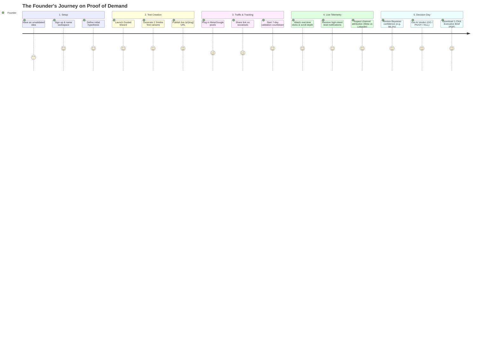
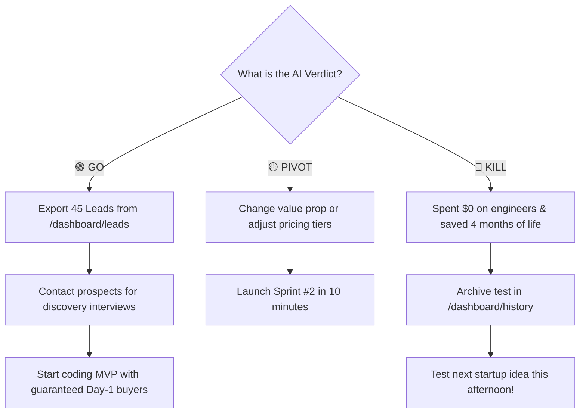

# Proof of Demand (PoD) — The Founder's Journey

**How a founder uses PoD to go from an unvalidated idea to a data-backed GO / PIVOT / KILL verdict in 7 days without writing a single line of product code.**

---

## 🗺️ Visual Workflow



---

## ⏱️ Step-by-Step Breakdown

### Step 1: The Spark (60 Seconds)
* **The Problem**: A founder has an exciting startup idea (e.g., *"An AI receipt scanner that does automated tax prep for freelance designers"*). Traditionally, founders spend 3–6 months coding an MVP before showing it to anyone, only to discover nobody will pay for it.
* **What they do in PoD**:
  1. Sign in via Clerk at `/sign-in`.
  2. Complete the rapid 3-step onboarding:
     - **Workspace Name**: `FinAI Studio`
     - **Project**: `TaxSnap AI`
     - **Core Hypothesis**: *"Freelance designers will pay $39/mo to never deal with receipt spreadsheets again."*
  3. Land on the **Command Center (`/dashboard`)** with a clean slate ready to launch test #1.

---

### Step 2: Generate the Smoke Test (Under 3 Minutes)
* **Goal**: Launch an authentic, conversion-focused smoke test web page to measure real user buying intent.
* **What they do in PoD**:
  1. Click **"New Experiment"** in the Experiments Hub (`/dashboard/experiments`).
  2. Select an experiment template: **Value Proposition & Pricing Test**.
  3. PoD automatically generates a responsive, high-converting public landing page (`/p/taxsnap`) with two competing variants:
     - **Variant A**: *"Save 10 hours every month on bookkeeping"* (Priced at $19/mo).
     - **Variant B**: *"Never worry about an IRS audit again"* (Priced at $39/mo).
  4. Both variants feature high-intent conversion hooks:
     - *"Join Early Access Waitlist"* (Name, Email, Job Title).
     - *"Reserve Early Founder Seat ($1 refundable deposit)"*.
  5. Click **Publish** — the page is live immediately.

---

### Step 3: Plug in Tracking & Start the Sprint
* **Goal**: Measure traffic attribution and set a strict timebox to avoid endless testing.
* **What they do in PoD**:
  1. Navigate to **Settings > Integrations** (`/dashboard/settings/integrations`).
  2. Paste their **Meta Pixel ID**, **Google Tag (gtag)**, or **LinkedIn Partner ID** (PoD automatically injects these scripts into the live `/p/taxsnap` page).
  3. Copy their tracked launch URL:
     ```text
     https://pod.engine/p/taxsnap?utm_source=linkedin&utm_campaign=launch
     ```
  4. Start a **7-Day Validation Sprint** (`/dashboard/sprint`) with measurable targets:
     - **Visitor Quota**: 200 targeted visitors
     - **Lead Quota**: 30 qualified email signups
     - **WTP Quota**: 5 deposit clicks

---

### Step 4: Watch Live Telemetry & Demand Signals (Days 1–6)
* **Goal**: Observe how real prospects behave when evaluating the offer.
* **What they do in PoD**:
  1. **Notification Drawer**: The bell icon in the dashboard navbar rings with real-time updates:
     - 🔔 *"New high-intent lead: Sarah Jenkins (Creative Director) joined waitlist."*
     - 🧪 *"Variant B reached 95% statistical significance over control."*
  2. **Demand Signals Feed (`/dashboard/signals`)**:
     - Monitor real visitor telemetry: CTA button clicks, scroll depth past the hero section, dwell time on pricing cards, and bounce rates.
  3. **Attribution & Audience Analytics (`/dashboard/audiences`)**:
     - **Channel Discovery**: Discovers that **LinkedIn traffic converts at 16%**, while **Twitter/X traffic converts at only 2%**.
     - **Copy Discovery**: Sees that **Variant B (Audit Fear / $39)** is outperforming **Variant A (Time Saving / $19)** by 3:1 in conversion volume.

---

### Step 5: The AI Verdict & Decision Day (Day 7)
* **Goal**: Get an unvarnished, mathematical answer: **Should I build this, pivot, or kill it?**
* **What they do in PoD**:
  1. Open the **AI Analyst (`/dashboard/ai-analyst`)**.
  2. The statistical engine confirms:
     > *"Variant B reached 98.4% statistical significance over Control with a +184% lift in conversion."*
  3. The AI reviews conversion rates, willingness-to-pay clustering, and bounce rates, delivering an unambiguous verdict:
     - 🟢 **VERDICT: GO**
     - **Core Insight**: *"Target audience values risk mitigation (audit protection) far higher than raw time savings. The $39–$49/mo price elasticity band shows strong commitment."*
  4. Click **"Download Executive Brief (PDF)"** (`/dashboard/reports`) to generate a clean 2-page brief with one click.

---

### Step 6: What Happens Next?



| If the Verdict is 🟢 GO | If the Verdict is 🔴 KILL |
| :--- | :--- |
| • Export the captured leads from `/dashboard/leads` as a Day-1 customer waitlist.<br>• Reach out to early signups for customer discovery interviews.<br>• Start engineering the MVP knowing **100% that paying demand exists**. | • Celebrate! The founder spent **$0 on engineering** and **saved 3–6 months** of wasted life.<br>• Archive the test into `/dashboard/history` so the team remembers why it failed.<br>• Spin up their next startup idea in the same afternoon! |

---

## 💡 Summary: Why This Changes Startup Building

| Traditional Founder Path | The Proof of Demand (PoD) Path |
| :--- | :--- |
| 1. Have an idea | 1. Have an idea |
| 2. Spend 4–6 months coding an MVP | 2. Spend 5 minutes deploying a PoD smoke test |
| 3. Launch on Product Hunt to silence | 3. Run a 7-day validation sprint with targeted traffic |
| 4. Realize nobody wants it | 4. Get a definitive, data-backed **GO / PIVOT / KILL** verdict |
| 5. Lose \$10,000–\$50,000 and months of time | 5. Only build things that people are already eager to pay for |
